# Information on Agilent Zedboard and tutorials on using Vivado and writing firmware and software


This documents explains how to build an operating system and how to create firmware / software for this board.

There is quite a bit of material on Zedboard, however some is quite outdated, as the board was create in 2012/2014.

We will use Vivado 2024.2 and PetaLinux 2024.2 for this. There is a very good [tutorial](https://spacewire.co.uk/tutorial/setup_vitis_vivado_petalinux/) which gives complete and working examples, but is based on Vivado / PetaLinux 2021.2.
Here, I'm adaptating this tutorial for version 2024.2.

## Try out board

To make sure the board is fine, use a normal size SD card (or a micro SD card with an adapter) of at least 4Gb, and place the original contents (part of this repo) on the SD card.

1. Format the partion of the SD card as FAT32 (if there are more partitions, just the first one is important).
2. Unzip the file `zedboard_oob_design.zip`, and copy the contents of the folder `ZedBoard_OOB_Design\sd_image` to the SD card.
3. Eject the SD card correctly to make sure the contents are not corrupted.
4. Connect the UART port to a PC using the mini USB to USB cable.
5. Make sure the board is set to boot from SD:
- JP2 is shortcut
- JP3 is shortcut
- JP7 (MI02) is in the low position
- JP8 (MI03) is in the low position
- JP9 (MI04) is in the high position
- JP10 (MI05) is in the high position
- JP11 (MI06) is in the low position

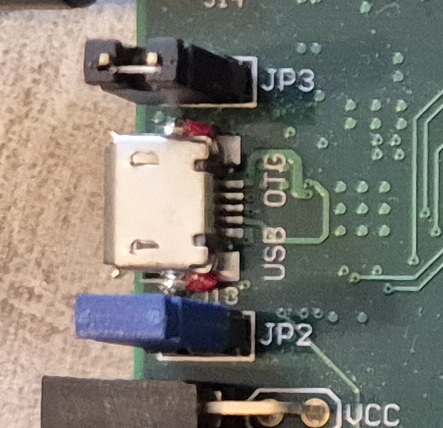
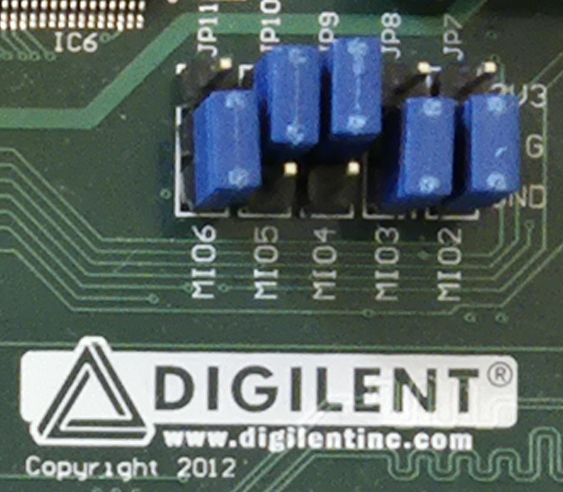

1. Power on the board, and make sure the USB serial port is recognized. On Windows 11, it is quite tricky to find the right driver as the USB chip is quite old. On Linux, the USB port should be recognized. The driver that should be found for Windows 11 is shown below.

2. Install a terminal application
  - On Linux for example minicom
  - On Windows Putty or Teraterm
3. Attach the terminal application to the serial device at 115200 N81.
4. Power off the board again.
5. Place the SD card in the board.
6. Open the terminal application.
7. Power on the board and wait some time until the blue led lights up.
8. After this you should see Linux boot on the console.

```text
U-Boot 2012.04.01-00297-gc319bf9-dirty (Sep 13 2012 - 09:30:49)

DRAM:  512 MiB
WARNING: Caches not enabled
MMC:   SDHCI: 0
Using default environment

In:    serial
Out:   serial
Err:   serial
Net:   zynq_gem
Hit any key to stop autoboot:  0
Copying Linux from SD to RAM...
Device: SDHCI
Manufacturer ID: 3
OEM: 5344
Name: SU08G
Tran Speed: 25000000
Rd Block Len: 512
SD version 2.0
High Capacity: Yes
Capacity: 7.4 GiB
Bus Width: 1-bit
reading zImage

2479640 bytes read
reading devicetree_ramdisk.dtb

5817 bytes read
reading ramdisk8M.image.gz


3694108 bytes read
## Starting application at 0x00008000 ...
Uncompressing Linux... done, booting the kernel.
[    0.000000] Booting Linux on physical CPU 0
[    0.000000] Linux version 3.3.0-digilent-12.07-zed-beta (tinghui.wang@DIGILENT_LINUX) (gcc version 4.6.1 (Sourcery CodeBench Lite 2011.09-50) ) #2 SMP PREEMPT Thu Jul 12 21:01:42 PDT 2012
[    0.000000] CPU: ARMv7 Processor [413fc090] revision 0 (ARMv7), cr=18c5387d
[    0.000000] CPU: PIPT / VIPT nonaliasing data cache, VIPT aliasing instruction cache

...

Starting rcS...
++ Mounting filesystem
++ Setting up mdev
++ Configure static IP 192.168.1.10
[    1.510000] GEM: lp->tx_bd ffdfb000 lp->tx_bd_dma 18fdc000 lp->tx_skb d8ac47c0
[    1.510000] GEM: lp->rx_bd ffdfc000 lp->rx_bd_dma 18fdd000 lp->rx_skb d8ac48c0
[    1.520000] GEM: MAC 0x00350a00, 0x00002201, 00:0a:35:00:01:22
[    1.520000] GEM: phydev d8b83400, phydev->phy_id 0x1410dd1, phydev->addr 0x0
[    1.530000] eth0, phy_addr 0x0, phy_id 0x01410dd1
[    1.530000] eth0, attach [Marvell 88E1510] phy driver
++ Starting telnet daemon
++ Starting http daemon
++ Starting ftp daemon
++ Starting dropbear (ssh) daemon
++ Starting OLED Display
[    1.570000] pmodoled-gpio-spi [zed_oled] SPI Probing
++ Exporting LEDs & SWs
rcS Complete
zynq> [    5.530000] eth0: link up (1000/FULL)

zynq>
zynq> ifconfig
eth0      Link encap:Ethernet  HWaddr 00:0A:35:00:01:22
          inet addr:192.168.1.10  Bcast:192.168.1.255  Mask:255.255.255.0
          UP BROADCAST RUNNING MULTICAST  MTU:1500  Metric:1
          RX packets:135 errors:0 dropped:3 overruns:0 frame:0
          TX packets:0 errors:0 dropped:0 overruns:0 carrier:0
          collisions:0 txqueuelen:1000
          RX bytes:8230 (8.0 KiB)  TX bytes:0 (0.0 B)
          Interrupt:54 Base address:0xb000

zynq>
```
Don't be confused by the prompt which looks like you're in U-boot, it is an actual Linux prompt.

9.  Finally after booting you should see the OLED display show the Digilent logo.


## Operating system

You can install and use Vivado and Vitis from Windows, however using PetaLinux can only be done on Linux.
For this reason I advise to work on Linux. You can use Linux from a VM if you like, just make sure of the following:
- Ubuntu versions supported are either 20.04.6, 22.04 and very early versions of 24.04. I chose to use Ubuntu 22.04.5
- Make sure you have sufficient available RAM (at lest 8Gb is required)
- Make sure you have sufficient disk space (installing, running and building takes around 400Gb)
- Make sure you have sufficient performance (especially building PetaLinux takes quite some time)

## Download files

Go to the [AMD / Xilinx site](https://www.xilinx.com/support/download.html), and log in (or create a new account).
Select 2024.2

The are two choices for download:
- [AMD Unified Installer for FPGAs & Adaptive SoCs 2024.2: Linux Self Extracting Web Installer](https://www.xilinx.com/member/forms/download/xef.html?filename=FPGAs_AdaptiveSoCs_Unified_2024.2_1113_2356_Lin64.bin) for Linux if you don't want to wait before starting installation and can have an internet connection while installing
- [AMD Unified Installer for FPGAs & Adaptive SoCs 2024.2 SFD](https://www.xilinx.com/member/forms/download/xef.html?filename=FPGAs_AdaptiveSoCs_Unified_2024.2_1113_2356.tar) if you want to download the full installer (124+ Gb)

I'll explain the installation from the second option.

## Install Vivado

:bangbang: **Important note:**
Parts of Vitis / Vivado may not install correctly if the virus scanner is active, especially on Windows. This may lead to confusing errors such as CMake not being able to configure. Consider temporarily switch off the virusscanner while installing.

The installer will be located in the `Downloads` subdirectory of your home directory (reference to as `~`).
Create installation directories and move the installer there.

```bash
user@machine:~$ sudo mkdir /opt/Xilinx
user@machine:~$ sudo chown $(id -un):$(id -gn) /opt/Xilinx
user@machine:~$ sudo mkdir -p /opt/xilinx/download
user@machine:~$ sudo chown -R $(id -un):$(id -gn) /opt/xilinx
user@machine:~$ mv ~/Downloads/FPGAs_AdaptiveSoCs_Unified_2024.2_1113_2356.tar /opt/xilinx/download
user@machine:~$ tar -xf /opt/xilinx/download/FPGAs_AdaptiveSoCs_Unified_2024.2_1113_2356.tar -C /opt/xilinx/download
```

Start the installer

```bash
user@machine:~$ /opt/xilinx/download/FPGAs_AdaptiveSoCs_Unified_2024.2_1113_2356/xsetup
```

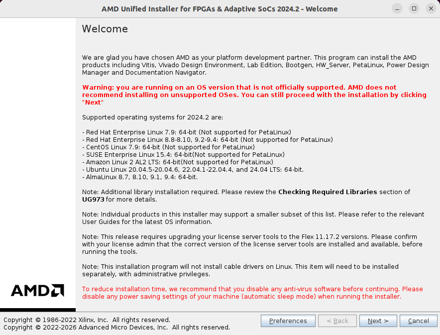

In the **Welcome** dialog click **Next** to proceed.


In the **Select Product to Install** dialog select **Vitis** and click **Next** to proceed.

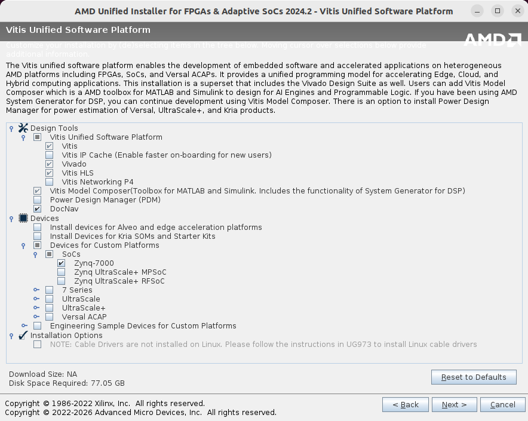

In the **Vitis Unified Software Platform** dialog, expand the menu items and select only what is required based on licensing and disk space. The default is to install everything which uses >200 Gb of disk space. The following shows the minimum required to use the ZedBoard with a WebPack license. Once happy with the selections click **Next** to proceed.


In the **Accept License Agreements** dialog, tick all **I Agree** boxes and click **Next** to proceed.

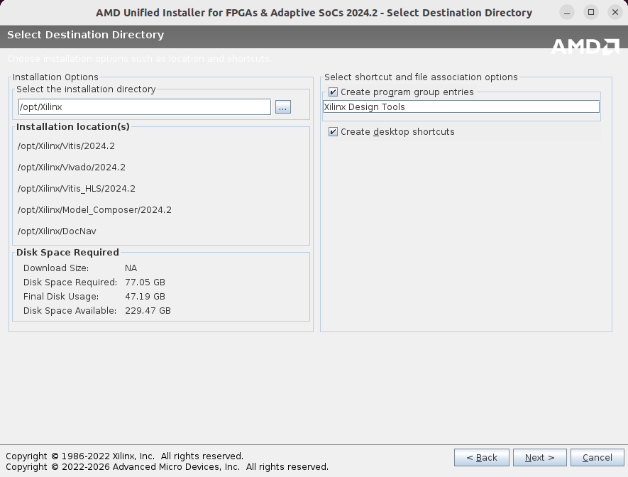

In the **Select Destination Directory** dialog, enter **/opt/Xilinx** for the installation directory, and click **Next** to proceed. Note the location of DocNav, this is not versioned like Vitis, Vivado & Vitis HLS, hence any existing DocNav installation at this location will be overwritten.

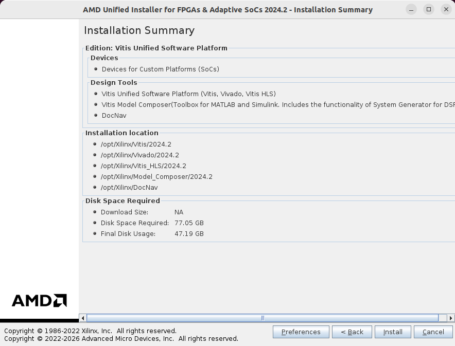

The **Installation Progress** dialog will now appear showing the progress of the installation (takes around 30 minutes to complete).


## Install JTAG drivers

Make sure the board is not connected to the JTAG USB cable.

```bash
user@machine:~$ cd /opt/Xilinx/Vivado/2024.2/data/xicom/cable_drivers/lin64/install_script/install_drivers
user@machine:/opt/Xilinx/Vivado/2024.2/data/xicom/cable_drivers/lin64/install_script/install_drivers$ sudo ./install_drivers
```

```text
INFO: Installing cable drivers.
INFO: Script name = ./install_drivers
INFO: HostName = petalinux-build
INFO: RDI_BINROOT= .
INFO: Current working dir = /opt/Xilinx/Vivado/2024.2/data/xicom/cable_drivers/lin64/install_script/install_drivers
INFO: Kernel version = 6.8.0-94-generic.
INFO: Arch = x86_64.
Successfully installed Digilent Cable Drivers
--File /etc/udev/rules.d/52-xilinx-ftdi-usb.rules does not exist.
--File version of /etc/udev/rules.d/52-xilinx-ftdi-usb.rules = 0000.
--Updating rules file.
--File /etc/udev/rules.d/52-xilinx-pcusb.rules does not exist.
--File version of /etc/udev/rules.d/52-xilinx-pcusb.rules = 0000.
--Updating rules file.

INFO: Digilent Return code = 0
INFO: Xilinx Return code = 0
INFO: Xilinx FTDI Return code = 0
INFO: Return code = 0
INFO: Driver installation successful.
CRITICAL WARNING: Cable(s) on the system must be unplugged then plugged back in order for the driver scripts to update the cables.
```

## Download PetaLinux

Again there are two choices:
- You can run the `AMD Unified Installer for FPGAs & Adaptive SoCs 2024.2: Linux Self Extracting Web Installer` again, and install PetaLinux this way. This will give you a standard location. In my case this failed for version 2024.2.
- Go to the [AMD / Xilinx site](https://www.xilinx.com/support/download.html), and log in (or create a new account).
Select 2024.2, and download [PetaLinux Tools - Installer](https://www.xilinx.com/member/forms/download/xef.html?filename=petalinux-v2024.2-11062026-installer.run)

For reference, use the following web page on PetaLinux: [UG1144](https://docs.amd.com/r/en-US/ug1144-petalinux-tools-reference-guide/Generate-MCS-Image?tocId=eyVYonb3Ea_anF_qmLeH~A)

## Prerequisites for using PetaLinux

### Set up TFTP

Although not really required, it is very wise to set up a TFTP server, as this enables you to boot from this server.

Install the TFTP deamon and setup the TFTP boot directory

```bash
user@machine:~$ sudo apt install tftpd-hpa tftp-hpa
user@machine:~$ sudo mkdir /tftpboot
user@machine:~$ sudo chown -R nobody:nogroup /tftpboot
user@machine:~$ sudo chmod -R 777 /tftpboot
```

Update the service configuration

```bash
user@machine:~$ sudo nano /etc/default/tftpd-hpa
```

```text
# /etc/default/tftpd-hpa

TFTP_USERNAME="tftp"
TFTP_DIRECTORY="/tftpboot"
TFTP_ADDRESS=":69"
TFTP_OPTIONS="--secure"
```

Restart the TFTP service

```bash
user@machine:~$ sudo systemctl restart tftpd-hpa
user@machine:~$ sudo systemctl enable tftpd-hpa
```

```text
tftpd-hpa.service is not a native service, redirecting to systemd-sysv-install.
Executing: /lib/systemd/systemd-sysv-install enable tftpd-hpa
```

Even though Ubuntu complains about the service not being native, it is restarted.

### Required packages

Make sure the following packages are installed:

```bash
user@machine:~$ sudo apt install tofrodos iproute2 gawk xvfb git make net-tools libncurses5-dev tftpd zlib1g-dev:i386 libssl-dev flex bison libselinux1 gnupg wget diffstat chrpath socat xterm autoconf libtool tar unzip texinfo zlib1g-dev gcc-multilib build-essential libsdl1.2-dev libglib2.0-dev screen pax gzip libtinfo5
 ```

Create a directory for petalinux installation:
```bash
user@machine:~$ sudo mkdir -p /opt/Xilinx/PetaLinux/2024.2/bin
user@machine:~$ sudo mkdir -p /opt/Xilinx/PetaLinux/2024.2/tool
user@machine:~$ sudo chown -R $(id -un):$(id -gn) /opt/Xilinx
```

For '\<user>' fill in your username (twice). This will make the directory tree have write permissions for you.

## Install PetaLinux

Copy the downloaded file to `/opt/Xilinx/PetaLinux/2024.2/bin`

```bash
user@machine:~$ mv ~/Downloads/petalinux-v2024.2-11062026-installer.run /opt/xilinx/download
user@machine:~$ cd /opt/xilinx/download
user@machine:~$ chmod +x petalinux-v2024.2-11062026-installer.run
user@machine:~$ mkdir -p /opt/Xilinx/Peta:inux/2024.2/tool
user@machine:~$ ./petalinux-v2024.2-11062026-installer.run --log petalinux-v2024.2-install.log --dir /opt/Xilinx/PetaLinux/2024.2/tool
```

```text
PetaLinux CMD tools installer version 2024.2
============================================
[WARNING] This is not a supported OS
[INFO] Checking free disk space
[INFO] Checking installed tools
[INFO] Checking installed development libraries
[INFO] Checking network and other services
[WARNING] No tftp server found - please refer to "UG1144  PetaLinux Tools Documentation Reference Guide" for its impact and solution

LICENSE AGREEMENTS

PetaLinux SDK contains software from a number of sources.  Please review
the following licenses and indicate your acceptance of each to continue.

You do not have to accept the licenses, however if you do not then you may 
not use PetaLinux SDK.

Use PgUp/PgDn to navigate the license viewer, and press 'q' to close

Press Enter to display the license agreements
```

When requested to agree to licenses press Enter, then you will be asked twice to agree.
Each time, press q to get out of the viewer, and then y and Enter to agree.
PetaLinux will then install itself.

```text
Do you accept Xilinx End User License Agreement? [y/N] > y
Do you accept Third Party End User License Agreement? [y/N] > y
[INFO] Installing PetaLinux SDK...done
[INFO] Setting it up...done
[INFO] Extracting xsct tarball...done
[INFO] PetaLinux SDK has been successfully set up and is ready to be used.
```

## Cleanup

As the Vivado installation files take up quite some space, remove them. Leave the original download in place, just in case.

```bash
user@machine:~$ rm -rf /opt/xilinx/download/FPGAs_AdaptiveSoCs_Unified_2024.2_1113_2356
```

## Create project infrastructure

It is wise to set up a standard infrastructure for projects concerning Vivado, Vitis and PetaLinux.
I'll follow the spacewire tutorial here, as it adds some convenient scripts and sets up a common structure.

### Create a common projects directory

```bash
user@machine:~$ mkdir -p ~/xilinx/common/{fw/src/{constraint,script},sw/src/{bsp,script},other/src/script}
user@machine:~$ cd ~/xilinx/common
```

### Unpack constraints

First make sure the file `zedboard_master_UCF_RevC_v3.zip` (part of this repo) is located in `/opt/xilinx/download`.

```bash
user@machine:~/xilinx/common$ unzip /opt/xilinx/download/zedboard_master_XDC_RevC_D_v3.zip -d ~/xilinx/common/fw/src/constraint
```

### Create scripts

#### other/src/script/create_project_structure.sh

```bash
user@machine:~/xilinx/common$ gedit other/src/script/create_project_structure.sh
```

Add the following contents

```bash
#!/bin/bash


#
# File .......... create_project_structure.sh
# Author ........ Steve Haywood
# Version ....... 1.0
# Date .......... 29 December 2021
# Description ...
#   Simple script to create a possible project directory structure for combined
# firmware, hardware, operating system & software development. Very much work
# in progress and by all means not a golden solution to anything.
#


# Print instructions
function print_args {
  printf "\n"
  printf "Create project (FW, HW, OS & SW) directory structure\n"
  printf "\n"
  printf "Usage: %s dir\n" $1
  printf "\n"
  printf "Where: dir .... Project directory to create & populate\n"
  printf "\n"
  printf "Example: %s ~/projects/example_project\n" $1
  printf "Example: %s /usr/projects/hello_world\n" $1
  printf "\n"
  exit 1
}


# Deal with command line arguments
if [ $# != 1 ]; then
  print_args $0
fi


# Get project base directory
base=$1


# Echo operation
echo "Creating project directory structure @ ${base}"


# Project directories
declare -a dirs=(
  # Firmware
  "fw/src/constraint"
  "fw/src/design"
  "fw/src/diagram"
  "fw/src/document"
  "fw/src/ip"
  "fw/src/ip_repo"
  "fw/src/other"
  "fw/src/script"
  "fw/src/testbench"
  "fw/vivado"
  # Hardware
  "hw/src/schematic"
  # Operating System
  "os/src/other"
  # Software
  "sw/src/c"
  "sw/src/other"
  "sw/src/script"
  "sw/vitis"
)


# Iterate through directories
for dir in "${dirs[@]}"
do
#  echo "Creating ... ${base}/${dir}"
  mkdir -p "${base}/${dir}"
done


# Create C source starter file
touch "${base}/sw/src/c/$(basename $base).c"
```

#### fw/src/script/create_vivado_project.sh

```bash
user@machine:~/xilinx/common$ gedit fw/src/script/create_vivado_project.sh
```

Add the following contents

```bash
#!/bin/bash

#
# File .......... create_vivado_project.sh
# Author ........ Steve Haywood
# Version ....... 1.0
# Date .......... 03 May 2021
# Description ...
#   Very simple script to launch Vivado and run the TCL script. Should be run
# in the project host directory that contains the fw & sw subdirectories, for
# example :-
#
# user@host:~/projects/project$ create_vivado_project.sh
# user@host:~/projects/project$ create_vivado_project.sh build
#

# Get command line arguments
if [ $# == 1 ]; then
  arg1=$1
else
  arg1=""
fi

# Get script location
dir_script=$( cd -- "$( dirname -- "${BASH_SOURCE[0]}" )" &> /dev/null && pwd )

# Get present working directory
dir_pwd=$(pwd)

# Set directory structure
dir_base="fw"
dir_fw_project="vivado"

# Sanity check directory structure
if [ -d "${dir_pwd}/${dir_base}" ]; then
  if [ ! -e "${dir_pwd}/${dir_base}/${dir_fw_project}" ]; then

    # Launch Vivado
    if [ "$arg1" == "build" ]; then
      vivado -nojournal -nolog -notrace -mode gui -source "${dir_script}/create_vivado_project.tcl" -tclargs build &
    else
      vivado -nojournal -nolog -notrace -mode gui -source "${dir_script}/create_vivado_project.tcl" &
    fi

  else
    echo "Error: Firmware project directory \"${dir_base}/${dir_fw_project}\" already exists, exiting."
  fi
else
  echo "Error: Firmware base directory \"${dir_base}\" does not exists, exiting."
fi
```

#### fw/src/script/create_vivado_project.tcl

```bash
user@machine:~/xilinx/common$ gedit fw/src/script/create_vivado_project.tcl
```

Add the following contents

```bash
#
# File .......... create_vivado_project.tcl
# Author ........ Steve Haywood
# Version ....... 1.0
# Date .......... 23 December 2021
# Description ...
#   Simple Tcl script to create a new Vivado project, import external
# sources and (optionally) generate the bitstream & export the hardware.
#

puts "Set Global variables"
set dir_firmware    "fw/vivado"
set dir_user        "../src"
set dir_diagram     "$dir_user/diagram"
set dir_design      "$dir_user/design"
set dir_ip          "$dir_user/ip"
set dir_ip_repo     "$dir_user/ip_repo"
set dir_constraint  "$dir_user/constraint"
set dir_testbench   "$dir_user/testbench"
set dir_script      "$dir_user/script"

puts "NOTE: Create project directory, project & change PWD"
create_project project $dir_firmware -part xc7z020clg484-1
cd $dir_firmware

puts "NOTE: Add local IP Repository"
if {[file exist $dir_ip_repo]} {
  set_property  ip_repo_paths  $dir_ip_repo [current_project]
  update_ip_catalog
}

puts "NOTE: Add scripts"
add_files -quiet -norecurse -fileset utils_1 $dir_script
set tcls [get_files *.tcl]
foreach tcl $tcls {
  set tcl_name [file tail $tcl]
  switch $tcl_name {
    "pre_synth.tcl" {
      set_property STEPS.SYNTH_DESIGN.TCL.PRE [ get_files $tcl -of [get_fileset utils_1] ] [get_runs synth_1]
    }
    "post_bit.tcl" {
      set_property STEPS.WRITE_BITSTREAM.TCL.POST [ get_files $tcl -of [get_fileset utils_1] ] [get_runs impl_1]
    }
    default {
      puts "NOTE: Unfamiliar tcl script found - $tcl_name"
    }
  }
}

puts "NOTE: Add block designs"
add_files -quiet -norecurse [glob -nocomplain "$dir_diagram/*/*.bd"]

puts "NOTE: Add design sources"
add_files -quiet -norecurse $dir_design

puts "NOTE: Add IPs"
add_files -quiet [glob -nocomplain "$dir_ip/*/*.xci"]

puts "NOTE: Add constraints"
add_files -quiet -norecurse -fileset constrs_1 $dir_constraint

puts "NOTE: Add testbench sources"
add_files -quiet -norecurse -fileset sim_1 $dir_testbench

puts "NOTE: Recreate (by opening) all block designs..."
set bds [glob -nocomplain "$dir_diagram/*/*.bd"]
foreach bd $bds {
  puts "NOTE: Open \"$bd\" block design"
  open_bd_design $bd
}

puts "NOTE: Generate all (none-overwrite) block designs wrappers..."
set bds [get_bd_designs -quiet]
foreach bd $bds {
  puts "NOTE: Generate \"$bd\" block design wrapper"
  set bd_file [get_files $bd.bd]
  set bd_path [file dirname $bd_file]
  set wrapper_files [glob -nocomplain $bd_path/hdl/${bd}_wrapper.*]
  if {[llength $wrapper_files] == 0} {
    set wrapper_file [make_wrapper -files $bd_file -top]
  }
  add_files -quiet -norecurse $bd_path/hdl
}

puts "NOTE: Close all block designs..."
set bds [get_bd_designs -quiet]
foreach bd $bds {
  puts "NOTE: Close \"$bd\" block design"
  close_bd_design $bd
}

puts "NOTE: Check for build argument..."
if { $argc == 1 } {
  set arg0 [lindex $argv 0]
  if { $arg0 == "build" } {
    puts "NOTE: Generate bitstream & export hardware"
    launch_runs impl_1 -to_step write_bitstream -jobs 4
    wait_on_run impl_1
    write_hw_platform -fixed -include_bit -force -file ../system_wrapper.xsa
  }
}

puts "NOTE: That's all folks!"
```

#### sw/src/script/create_vitis_project.sh

```bash
user@machine:~/xilinx/common$ gedit sw/src/script/create_vitis_project.sh
```

Add the following contents

```bash
#!/bin/bash

#
# File .......... create_vitis_project.sh
# Author ........ Steve Haywood
# Version ....... 1.0
# Date .......... 03 May 2021
# Description ...
#   Very simple script to launch the Xilinx software command-line tool,
# run the TCL script and launch Vitis. Should be run in the project host
# directory that contains the fw & sw subdirectories, for example :-
#
# user@host:~/projects/project$ create_vitis_project.sh
# user@host:~/projects/project$ create_vitis_project.sh build
#

# Get command line arguments
if [ $# == 1 ]; then
  arg1=$1
else
  arg1=""
fi

# Get script location
dir_script=$( cd -- "$( dirname -- "${BASH_SOURCE[0]}" )" &> /dev/null && pwd )

# Get present working directory
dir_pwd=$(pwd)

# Set directory structure
dir_base="sw"
dir_sw_project="vitis"

# Sanity check directory structure
if [ -d "${dir_pwd}/${dir_base}" ]; then
  if [ ! -e "${dir_pwd}/${dir_base}/${dir_sw_project}" ]; then

    # Get last element of path (project name)
    dir_project=${dir_pwd##*/}

    # Call Xilinx Software Commandline Tool
    if [ "$arg1" == "build" ]; then
      xsct "${dir_script}/create_vitis_project.tcl" "${dir_project}" build
    else
      xsct "${dir_script}/create_vitis_project.tcl" "${dir_project}"
    fi

    # Launch Vitis
    vitis -workspace "${dir_base}/${dir_sw_project}" &

  else
    echo "Error: Software project directory \"${dir_base}/${dir_sw_project}\" already exists, exiting."
  fi
else
  echo "Error: Software base directory \"${dir_base}\" does not exists, exiting."
fi
```

#### sw/src/script/create_vitis_project.tcl

```bash
user@machine:~/xilinx/common$ gedit sw/src/script/create_vitis_project.tcl
```

Add the following contents

```bash
#
# File .......... create_vitis_project.tcl
# Author ........ Steve Haywood
# Version ....... 1.0
# Date .......... 21 Dec 2021
# Description ...
#   Simple Tcl script to create a new Vitis application, import external
# sources and (optionally) build the application.
#

# Check for project name argument, exit if not found.
if { $argc == 0 } {
  puts "Error: No project name provided, exiting..."
  exit 1
}
set project [lindex $argv 0]

# Create and build new project.
setws sw/vitis
app create -name $project -hw fw/system_wrapper.xsa -os standalone -proc ps7_cortexa9_0 -template {Empty Application(C)}
set abs_path [file normalize sw/src/c]
importsources -name $project -path $abs_path -soft-link
if { $argc > 1 } {
  set arg1 [lindex $argv 1]
  if { $arg1 == "build" } {
    app build -name $project
  }
}
```

#### other/src/script/xilinx_2024_2.sh

```bash
user@machine:~/xilinx/common$ gedit other/src/script/xilinx_2024_2.sh
```

Add the following contents

```bash
#!/bin/bash

# Setup Vitis, Vivado, Vitis HLS & DocNav environment
source /opt/Xilinx/Vivado/2024.2/settings64.sh
# Setup PetaLinux environment
source /opt/Xilinx/PetaLinux/2024.2/tool/settings.sh
```

#### other/src/script/xilinx.sh

```bash
user@machine:~/xilinx/common$ gedit other/src/script/xilinx.sh
```

Add the following contents

```bash
#!/bin/bash

#
# File .......... xilinx.sh
# Author ........ Steve Haywood
# Version ....... 1.0
# Date .......... 8 February 2021
# Description ...
#   Determine and list which Xilinx tools are available and let the user select
# the require ones to use. Does not reverse any previously selected tools upon
# selecting news ones so to is cleaner to use in a new Terminal session.
#

# Define install base location
dir_base="/opt/Xilinx"

# Define number of tools (Vivado, SDK, Vitis & PetaLinux)
tools=4

# Define tool directories, executables & settings scripts
dir_tool=("Vivado" "SDK" "Vitis" "PetaLinux")
exe_tool=("vivado" "xsdk" "vitis" "petalinux-build")
set_tool=("settings64.sh" "settings64.sh" "settings64.sh" "tool/settings.sh")

# Define terminal colours
col_default=$(tput sgr0)
col_red=$(tput setaf 1)
col_green=$(tput setaf 2)
col_blue=$(tput setaf 4)
col_fail_pass=(${col_red} ${col_green})

# Exit if script wasn't sourced
if [[ "${BASH_SOURCE[0]}" == "${0}" ]]; then
  printf "Script needs to be sourced : source ${BASH_SOURCE[0]}\n"
  exit 1
fi

# Get array of directories at base location
readarray -t dirs < <(find "${dir_base}/${dir_tool[0]}" -mindepth 1 -maxdepth 1 -printf '%P\n')

# Sort directories array
dirs=($(IFS=$'\n'; echo "${dirs[*]}" | sort))

# Determine and list what tools are installed
declare -A table
printf "Xilinx tools available tools at ${dir_base} :-\n"
for ((dir=1; dir<=${#dirs[@]}; dir++)); do
  printf "${dir}) ${dirs[$((dir-1))]}"
  for ((tool=0; tool<${tools}; tool++)); do
    table[${dir}, ${tool}]=$([ ! -d "${dir_base}/${dir_tool[${tool}]}/${dirs[$((dir-1))]}" ]; echo $?)
    printf "${col_default} - "
    printf "${col_fail_pass[${table[${dir}, ${tool}]}]}"
    printf "${dir_tool[${tool}]}"
    printf "${col_default}"
  done
  printf "\n"
done
printf "0) Exit\n"
printf "Please select tools required or exit"

# Obtain user input and source settings for selected tools
while true; do
  read -p " : " sel
  if ! [[ "${sel}" =~ ^[0-9]+$ ]] ; then
    # User input is not a number
    printf "Invalid choice, select again"
  elif [ ${sel} -ge 1 ] && [ ${sel} -le ${#dirs[@]} ]; then
    # User input is out of range
    printf "\nTools are as follows :-\n" "${sel}"
    for ((tool=0; tool<${tools}; tool++)); do
      if [ ${table[${sel}, ${tool}]} -eq 1 ]; then
        source "${dir_base}/${dir_tool[${tool}]}/${dirs[$((sel - 1))]}/${set_tool[${tool}]}" > /dev/null 2>&1
        printf "${col_blue}${exe_tool[${tool}]}${col_default} @ "
        bin=$(which "${exe_tool[${tool}]}")
        if [ -z ${bin} ]; then
          printf "${col_red}Not found!"
        else
          printf "${col_green}%s" "${bin}"
        fi
        printf "${col_default}\n"
      fi
    done
    break
  elif [ ${sel} -eq 0 ]; then
    printf "Quiting without selection!\n"
    break
  else
    printf "Invalid choice, select again"
  fi
done
```

### Set credentials for scripts

```bash
user@machine:~/xilinx/common$ chmod +x other/src/script/create_project_structure.sh
user@machine:~/xilinx/common$ chmod +x fw/src/script/create_vivado_project.sh
user@machine:~/xilinx/common$ chmod +x sw/src/script/create_vitis_project.sh
user@machine:~/xilinx/common$ chmod +x other/src/script/xilinx_2024_2.sh
user@machine:~/xilinx/common$ chmod +x other/src/script/xilinx.sh
```

### Test the scripts

```bash
user@machine:~/xilinx/common$ source other/src/script/xilinx.sh
```

```text
Xilinx tools available tools at /opt/Xilinx :-
1) 2024.2 - Vivado - SDK - Vitis - PetaLinux
0) Exit
Please select tools required or exit : 1

Tools are as follows :-
vivado @ /opt/Xilinx/Vivado/2024.2/bin/vivado
vitis @ /opt/Xilinx/Vitis/2024.2/bin/vitis
petalinux-build @ /opt/Xilinx/PetaLinux/2024.2/tool/scripts/petalinux-build
```

### Add aliases for scripts

```bash
user@machine:~$ gedit ~/.bashrc
```

Add the end of the file add:

```bash
# Aliases
alias xilinx='source xilinx.sh'
alias minized='minicom -D /dev/ttyACM0 -b 115200'

# Paths
PATH="~/xilinx/common/fw/src/script:"$PATH
PATH="~/xilinx/common/other/src/script:"$PATH
PATH="~/xilinx/common/sw/src/script:"$PATH
```

Close the current terminal and open a new one. The aliases should now be available.

```bash
user@machine:~$ xilinx
```

```text
Xilinx tools available tools at /opt/Xilinx :-
1) 2024.2 - Vivado - SDK - Vitis - PetaLinux
0) Exit
Please select tools required or exit : 1

Tools are as follows :-
vivado @ /opt/Xilinx/Vivado/2024.2/bin/vivado
vitis @ /opt/Xilinx/Vitis/2024.2/bin/vitis
petalinux-build @ /opt/Xilinx/PetaLinux/2024.2/tool/scripts/petalinux-build
```

## Create a hardware platform for zedboard

### Select the tools

```bash
user@machine:~$ xilinx
```

```text
Xilinx tools available tools at /opt/Xilinx :-
1) 2024.2 - Vivado - SDK - Vitis - PetaLinux
0) Exit
Please select tools required or exit : 1

Tools are as follows :-
vivado @ /opt/Xilinx/Vivado/2024.2/bin/vivado
vitis @ /opt/Xilinx/Vitis/2024.2/bin/vitis
petalinux-build @ /opt/Xilinx/PetaLinux/2024.2/tool/scripts/petalinux-build
```

In order to create a PetaLinux project, we need to create a hardware platform first.
This will be stored in a .xsa file.

### Create a Vivado project

```bash
user@machine:~$ create_project_structure.sh ~/xilinx/zedboard
user@machine:~$ cd ~/xilinx/zedboard
user@machine:~/xilinx/zedboard$ vivado -nojournal -nolog -notrace &
```

Create a new project.


Select **Create Project**

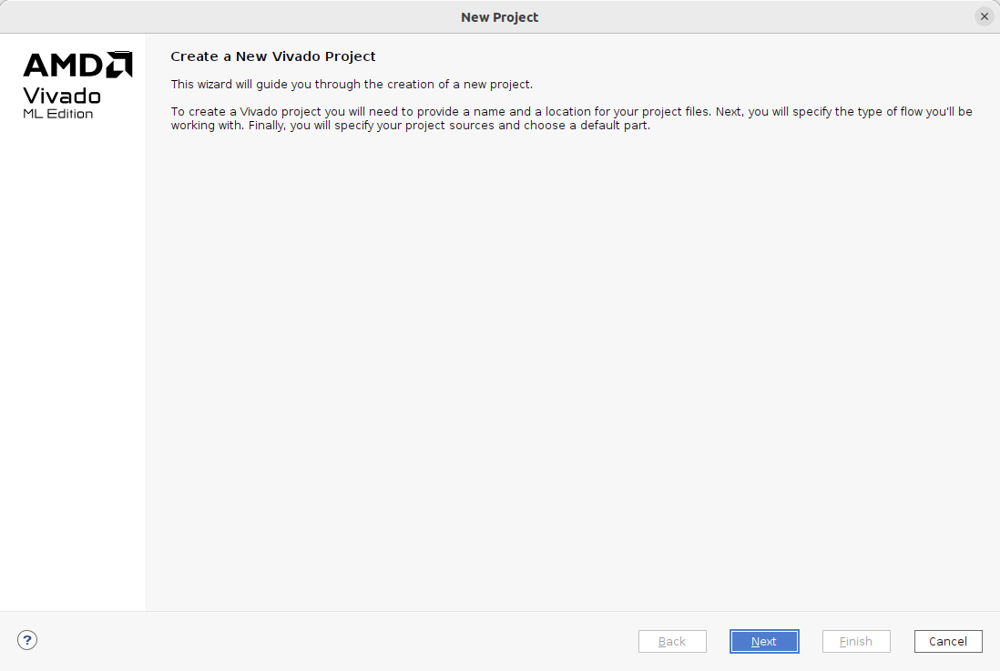

Select **Next**.


Fill in the project location and name:
- Name: project
- Location: ~/xilinx/zedboard/fw/vivado

Select **Next**.


Select **Do not specify sources at this time**, select **Next**.

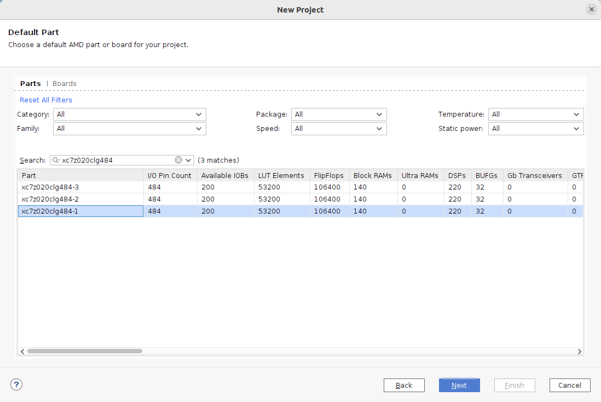

In the **Search** box, type **xc7z020clg484**, and select **xc7z020clg484-1**, select **Next**. 

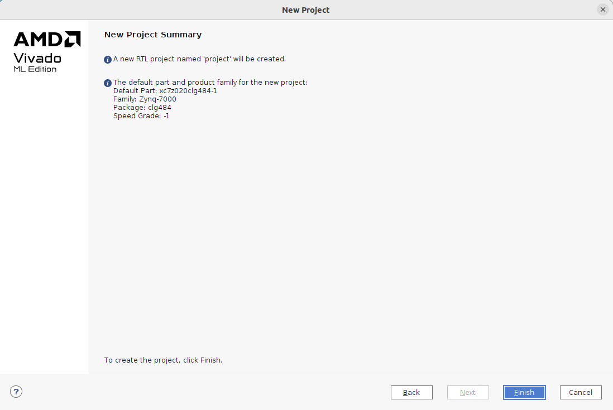

Select **Finish**.


From the **Flow Navigator**, under **IP INTEGRATOR** select **Create Block Design**.


Fill in the name and directory:
- Name: system
- Directory: ~/xilinx/zedboard/fw/src/diagram
  
Select **OK**.


In the **Diagram** panel, click **+** to add a component.


In the **Search** box, type **zynq**, select **Zynq Processing System**, and press **Enter**.


In the green bar at the top, select **Run Block Automation**.


Select **OK**.


#### Set up the board presets

Add the file `~/xilinx/common/fw/src/script/zedboard_presets.tcl`. This will amongst others enable the GPIO pins.

```bash
user@machine:~$ gedit ~/xilinx/common/fw/src/script/zedboard_presets.tcl
```

Add the following text

```text
# Peripheral I/O Pins
set_property -dict [list \
CONFIG.PCW_PRESET_BANK1_VOLTAGE {LVCMOS 1.8V} \
CONFIG.PCW_QSPI_PERIPHERAL_ENABLE {1} \
CONFIG.PCW_QSPI_GRP_SINGLE_SS_ENABLE {1} \
CONFIG.PCW_ENET0_PERIPHERAL_ENABLE {1} \
CONFIG.PCW_ENET0_ENET0_IO {MIO 16 .. 27} \
CONFIG.PCW_ENET0_GRP_MDIO_ENABLE {1} \
CONFIG.PCW_ENET0_GRP_MDIO_IO {MIO 52 .. 53} \
CONFIG.PCW_SD0_PERIPHERAL_ENABLE {1} \
CONFIG.PCW_SD0_GRP_CD_ENABLE {1} \
CONFIG.PCW_SD0_GRP_CD_IO {MIO 47} \
CONFIG.PCW_SD0_GRP_WP_ENABLE {1} \
CONFIG.PCW_SD0_GRP_WP_IO {MIO 46} \
CONFIG.PCW_UART1_PERIPHERAL_ENABLE {1} \
CONFIG.PCW_TTC0_PERIPHERAL_ENABLE {1} \
CONFIG.PCW_USB0_PERIPHERAL_ENABLE {1} \
CONFIG.PCW_GPIO_MIO_GPIO_ENABLE {1} \
CONFIG.PCW_GPIO_MIO_GPIO_IO {MIO} \
] [get_bd_cells processing_system7_0]

# MIO Configuration
set_property -dict [list \
CONFIG.PCW_MIO_0_PULLUP {disabled} \
CONFIG.PCW_MIO_1_PULLUP {disabled} \
CONFIG.PCW_MIO_1_SLEW {fast} \
CONFIG.PCW_MIO_2_SLEW {fast} \
CONFIG.PCW_MIO_3_SLEW {fast} \
CONFIG.PCW_MIO_4_SLEW {fast} \
CONFIG.PCW_MIO_5_SLEW {fast} \
CONFIG.PCW_MIO_6_SLEW {fast} \
CONFIG.PCW_MIO_8_SLEW {fast} \
CONFIG.PCW_MIO_9_PULLUP {disabled} \
CONFIG.PCW_MIO_10_PULLUP {disabled} \
CONFIG.PCW_MIO_11_PULLUP {disabled} \
CONFIG.PCW_MIO_12_PULLUP {disabled} \
CONFIG.PCW_MIO_13_PULLUP {disabled} \
CONFIG.PCW_MIO_14_PULLUP {disabled} \
CONFIG.PCW_MIO_15_PULLUP {disabled} \
CONFIG.PCW_MIO_16_PULLUP {disabled} \
CONFIG.PCW_MIO_16_SLEW {fast} \
CONFIG.PCW_MIO_17_PULLUP {disabled} \
CONFIG.PCW_MIO_17_SLEW {fast} \
CONFIG.PCW_MIO_18_PULLUP {disabled} \
CONFIG.PCW_MIO_18_SLEW {fast} \
CONFIG.PCW_MIO_19_PULLUP {disabled} \
CONFIG.PCW_MIO_19_SLEW {fast} \
CONFIG.PCW_MIO_20_PULLUP {disabled} \
CONFIG.PCW_MIO_20_SLEW {fast} \
CONFIG.PCW_MIO_21_PULLUP {disabled} \
CONFIG.PCW_MIO_21_SLEW {fast} \
CONFIG.PCW_MIO_22_PULLUP {disabled} \
CONFIG.PCW_MIO_22_SLEW {fast} \
CONFIG.PCW_MIO_23_PULLUP {disabled} \
CONFIG.PCW_MIO_23_SLEW {fast} \
CONFIG.PCW_MIO_24_PULLUP {disabled} \
CONFIG.PCW_MIO_24_SLEW {fast} \
CONFIG.PCW_MIO_25_PULLUP {disabled} \
CONFIG.PCW_MIO_25_SLEW {fast} \
CONFIG.PCW_MIO_26_PULLUP {disabled} \
CONFIG.PCW_MIO_26_SLEW {fast} \
CONFIG.PCW_MIO_27_PULLUP {disabled} \
CONFIG.PCW_MIO_27_SLEW {fast} \
CONFIG.PCW_MIO_28_PULLUP {disabled} \
CONFIG.PCW_MIO_28_SLEW {fast} \
CONFIG.PCW_MIO_29_PULLUP {disabled} \
CONFIG.PCW_MIO_29_SLEW {fast} \
CONFIG.PCW_MIO_30_PULLUP {disabled} \
CONFIG.PCW_MIO_30_SLEW {fast} \
CONFIG.PCW_MIO_31_PULLUP {disabled} \
CONFIG.PCW_MIO_31_SLEW {fast} \
CONFIG.PCW_MIO_32_PULLUP {disabled} \
CONFIG.PCW_MIO_32_SLEW {fast} \
CONFIG.PCW_MIO_33_PULLUP {disabled} \
CONFIG.PCW_MIO_33_SLEW {fast} \
CONFIG.PCW_MIO_34_PULLUP {disabled} \
CONFIG.PCW_MIO_34_SLEW {fast} \
CONFIG.PCW_MIO_35_PULLUP {disabled} \
CONFIG.PCW_MIO_35_SLEW {fast} \
CONFIG.PCW_MIO_36_PULLUP {disabled} \
CONFIG.PCW_MIO_36_SLEW {fast} \
CONFIG.PCW_MIO_37_PULLUP {disabled} \
CONFIG.PCW_MIO_37_SLEW {fast} \
CONFIG.PCW_MIO_38_PULLUP {disabled} \
CONFIG.PCW_MIO_38_SLEW {fast} \
CONFIG.PCW_MIO_39_PULLUP {disabled} \
CONFIG.PCW_MIO_39_SLEW {fast} \
CONFIG.PCW_MIO_40_PULLUP {disabled} \
CONFIG.PCW_MIO_40_SLEW {fast} \
CONFIG.PCW_MIO_41_PULLUP {disabled} \
CONFIG.PCW_MIO_41_SLEW {fast} \
CONFIG.PCW_MIO_42_PULLUP {disabled} \
CONFIG.PCW_MIO_42_SLEW {fast} \
CONFIG.PCW_MIO_43_PULLUP {disabled} \
CONFIG.PCW_MIO_43_SLEW {fast} \
CONFIG.PCW_MIO_44_PULLUP {disabled} \
CONFIG.PCW_MIO_44_SLEW {fast} \
CONFIG.PCW_MIO_45_PULLUP {disabled} \
CONFIG.PCW_MIO_45_SLEW {fast} \
CONFIG.PCW_MIO_46_PULLUP {disabled} \
CONFIG.PCW_MIO_47_PULLUP {disabled} \
CONFIG.PCW_MIO_48_PULLUP {disabled} \
CONFIG.PCW_MIO_49_PULLUP {disabled} \
CONFIG.PCW_MIO_50_PULLUP {disabled} \
CONFIG.PCW_MIO_51_PULLUP {disabled} \
CONFIG.PCW_MIO_52_PULLUP {disabled} \
CONFIG.PCW_MIO_53_PULLUP {disabled} \
] [get_bd_cells processing_system7_0]

# Clock Configuration
set_property -dict [list \
CONFIG.PCW_UIPARAM_DDR_FREQ_MHZ {533.333313} \
CONFIG.PCW_APU_PERIPHERAL_FREQMHZ {666.666667} \
CONFIG.PCW_SDIO_PERIPHERAL_FREQMHZ {50} \
CONFIG.PCW_UART_PERIPHERAL_FREQMHZ {50} \
CONFIG.PCW_FPGA0_PERIPHERAL_FREQMHZ {100} \
CONFIG.PCW_FPGA1_PERIPHERAL_FREQMHZ {150} \
CONFIG.PCW_EN_CLK1_PORT {0} \
] [get_bd_cells processing_system7_0]

# DDR Configuration
set_property -dict [list \
CONFIG.PCW_UIPARAM_DDR_DQS_TO_CLK_DELAY_0 {0.025} \
CONFIG.PCW_UIPARAM_DDR_DQS_TO_CLK_DELAY_1 {0.028} \
CONFIG.PCW_UIPARAM_DDR_DQS_TO_CLK_DELAY_2 {0.001} \
CONFIG.PCW_UIPARAM_DDR_DQS_TO_CLK_DELAY_3 {0.001} \
CONFIG.PCW_UIPARAM_DDR_BOARD_DELAY0 {0.41} \
CONFIG.PCW_UIPARAM_DDR_BOARD_DELAY1 {0.411} \
CONFIG.PCW_UIPARAM_DDR_BOARD_DELAY2 {0.341} \
CONFIG.PCW_UIPARAM_DDR_BOARD_DELAY3 {0.358} \
CONFIG.PCW_UIPARAM_DDR_PARTNO {MT41J128M16 HA-15E} \
CONFIG.PCW_UIPARAM_DDR_USE_INTERNAL_VREF {1} \
] [get_bd_cells processing_system7_0]
```

At the bottom select the tab **Tcl Console** and enter the following command

```bash
source ~/xilinx/common/fw/src/script/zedboard_presets.tcl
```

Notice that some pins on the Zynq have changed. A.o. the TTC clocks have been added.

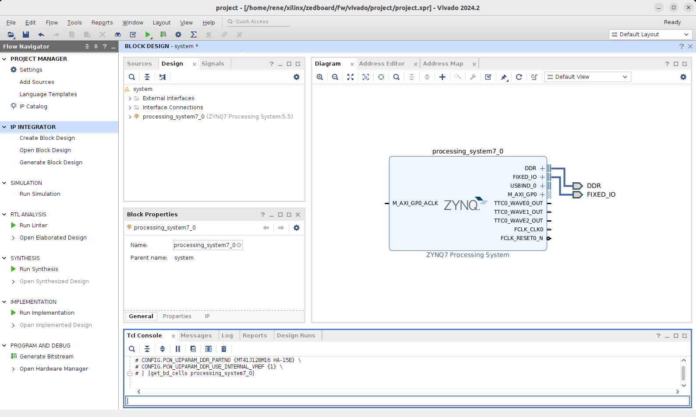

#### Disable unnneeded devices

Open the settings for the Zynq device. Double click on the **ZYNQ** symbol.

Remove the **USB 0** connection from the **ZYNQ7 Processing System** as it is not required for this design. Click on **MIO Configuration**, expand **I/O Peripherals** and untick **USB 0**.

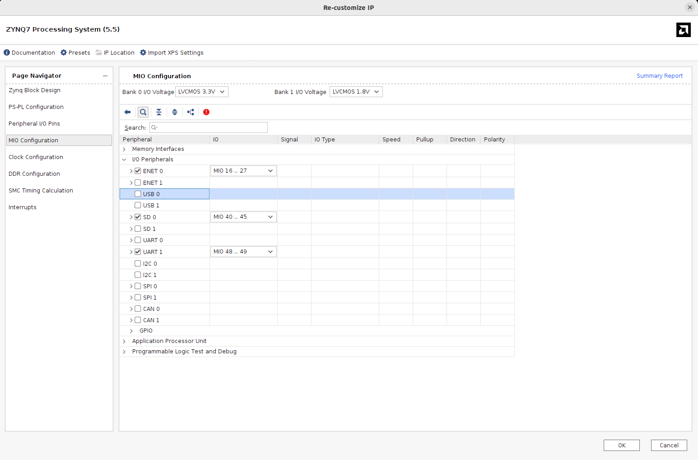

Remove the **Timer** connection from the **ZYNQ7 Processing System** as it is not required for this design. Click on **MIO Configuration**, expand **Application Processor Unit** and untick **Timer 0**.

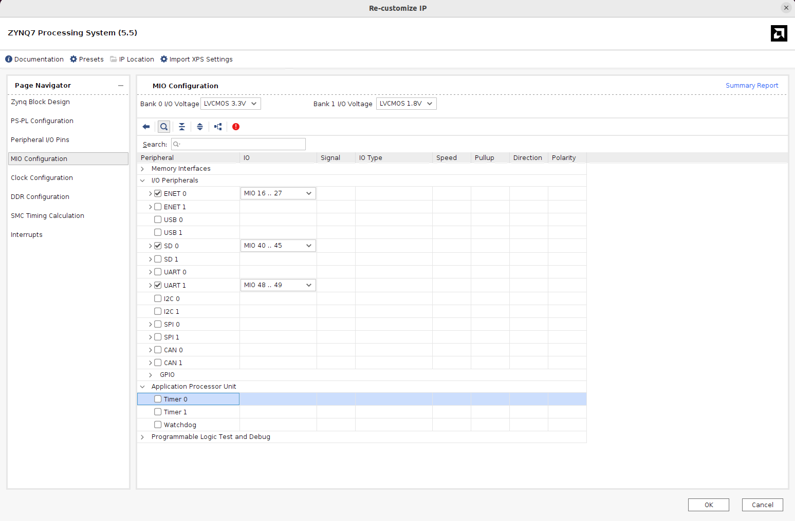

Select **OK**.

#### Add GPIO

In the Diagram panel, select **+** again and select **AXI GPIO**. Press **Enter**.

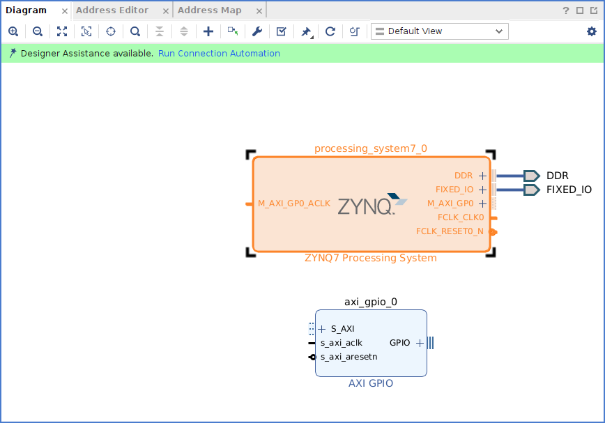

Customize the GPIO. Double click the **AXI GPIO** symbol.

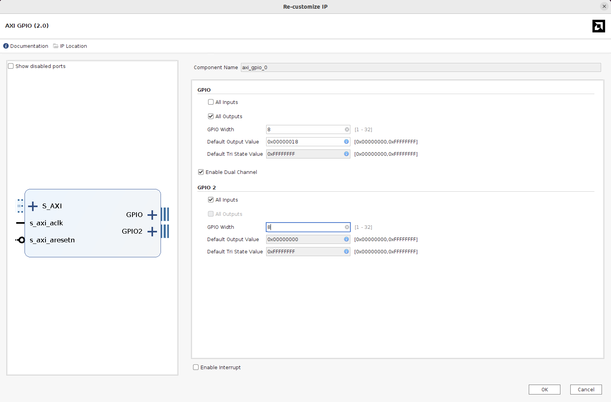

Under GPIO tick All Outputs, set the GPIO Width to 8 (for the LEDs) and set the Default Output Value to 0x00000018. Tick Enable Dual Channel, then under GPIO 2 tick All Inputs and set the GPIO Width to 8 (for switches).

Select **OK**.

Again, in the Diagram panel, select **+** again and select **AXI GPIO**. Press **Enter**.

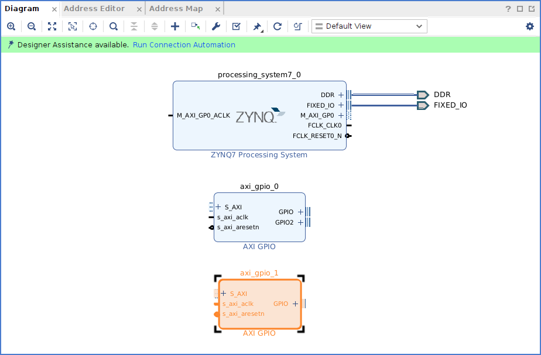

Customize the GPIO. Double click the **AXI GPIO** symbol.

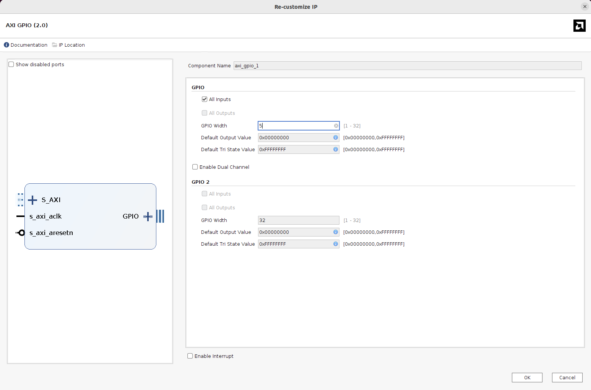

Under GPIO tick All Input, set the GPIO Width to 5 (for the pushbuttons).

Select **OK**.

In the green bar at the top, select **Run Block Automation** again.


Select **OK**.

You can use the **Regenerate Layout** button  to organize the layout.


Now rename the GPIO ports for clearer names.

Click the **gpio_rtl_0** port on **axi_gpio_0** and in the **External Interface Properties** window change the name to **leds_8bits**

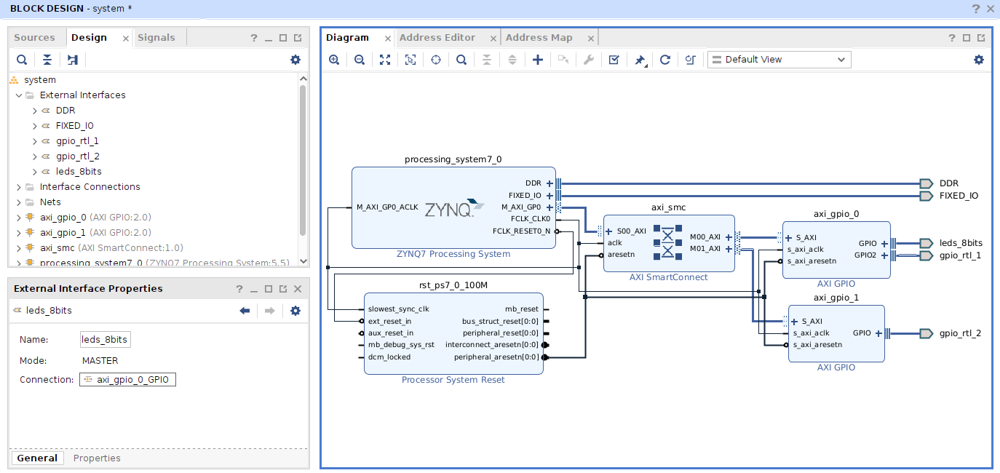

Click the **gpio_rtl_1** port on **axi_gpio_0** and in the **External Interface Properties** window change the name to **switches_8bits**

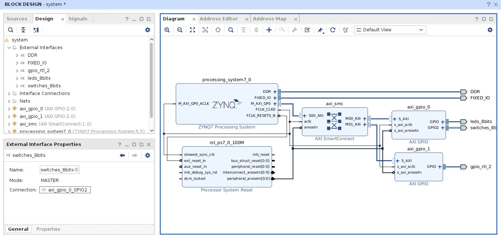

Click the **gpio_rtl_2** port on **axi_gpio_1** and in the **External Interface Properties** window change the name to **buttons_5bits**

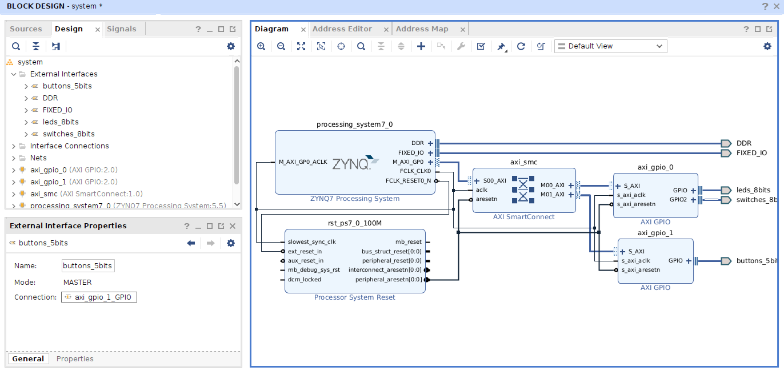

Select the **Address Editor** tab in the block design window. The addresses should be set as follows:

- axi_gpio_0: 0x4120 0000 Range 64K
- axi_gpio_1: 0x4121 0000 Range 64K

Adapt these values if needed.

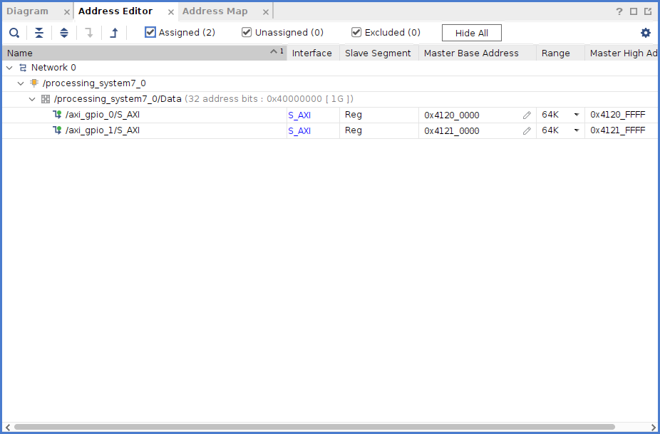

Validate the design. Select the **Design** tab in the left of the **BLOCK DESIGN** window, right click on the top level design **system** and select **Validate Design**.


Add a HDL wrapper source to the design. In the **Sources** tab, open **Design Sources**, and right click the yellow entry **system \(system.bd)**, and select **Create HDL Wrapper...**


Leave the option **Let Vivado manger wrapper and auto-update** selected, select **OK**.

#### Add constraints

Using the **zedboard_master_XDC_RevC_D_v3.xdc** from **~/xilinx/common/fw/src/constraint** as a reference constraints can be constructed for the design. Right click on **Constraints** under **Sources** within the **BLOCK DESIGN** window and select **Add Sources...** from the context menu.

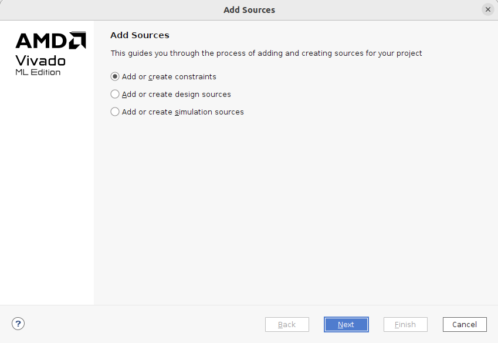

Select **Add or create constraints** select **Next**.

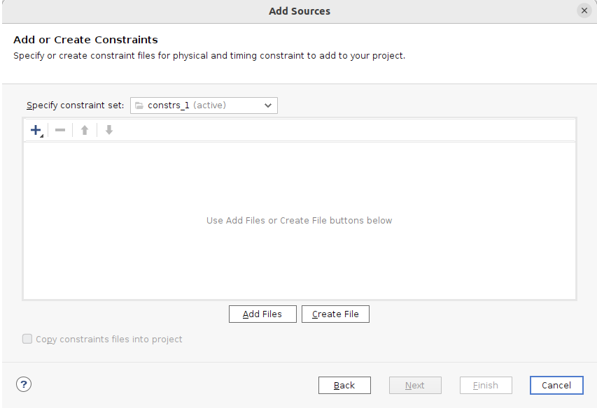

Click on **Create File**

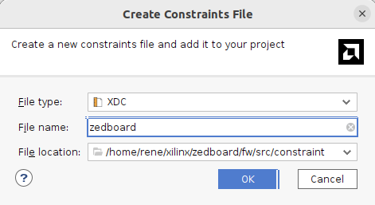

In the **Create Constraints File** dialogue set the **File name** to **zedboard**, set the **File location** to **~/xilinx/zedboard/fw/src/constraint** and then click **OK**.

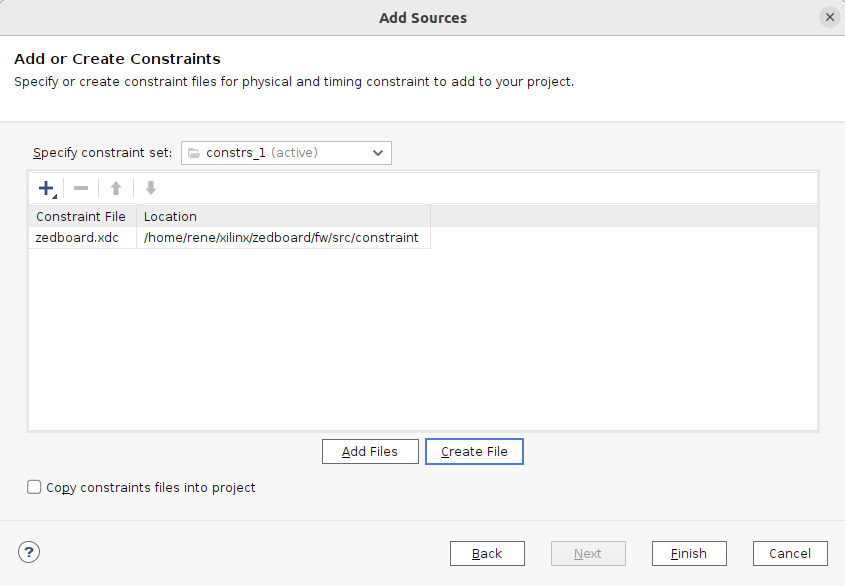

Select **Finish**.


In the **Sources** tab open the constraints **constrs_1** and double click on the file **zedboard.xdc**.

Add the following contents

```text
# User LEDs - Bank 33
set_property PACKAGE_PIN T22 [get_ports {leds_8bits_tri_o[0]}];  # "LD0"
set_property PACKAGE_PIN T21 [get_ports {leds_8bits_tri_o[1]}];  # "LD1"
set_property PACKAGE_PIN U22 [get_ports {leds_8bits_tri_o[2]}];  # "LD2"
set_property PACKAGE_PIN U21 [get_ports {leds_8bits_tri_o[3]}];  # "LD3"
set_property PACKAGE_PIN V22 [get_ports {leds_8bits_tri_o[4]}];  # "LD4"
set_property PACKAGE_PIN W22 [get_ports {leds_8bits_tri_o[5]}];  # "LD5"
set_property PACKAGE_PIN U19 [get_ports {leds_8bits_tri_o[6]}];  # "LD6"
set_property PACKAGE_PIN U14 [get_ports {leds_8bits_tri_o[7]}];  # "LD7"


# User DIP Switches - Bank 34 & 35
set_property PACKAGE_PIN F22 [get_ports {switches_8bits_tri_i[0]}];  # "SW0"
set_property PACKAGE_PIN G22 [get_ports {switches_8bits_tri_i[1]}];  # "SW1"
set_property PACKAGE_PIN H22 [get_ports {switches_8bits_tri_i[2]}];  # "SW2"
set_property PACKAGE_PIN F21 [get_ports {switches_8bits_tri_i[3]}];  # "SW3"
set_property PACKAGE_PIN H19 [get_ports {switches_8bits_tri_i[4]}];  # "SW4"
set_property PACKAGE_PIN H18 [get_ports {switches_8bits_tri_i[5]}];  # "SW5"
set_property PACKAGE_PIN H17 [get_ports {switches_8bits_tri_i[6]}];  # "SW6"
set_property PACKAGE_PIN M15 [get_ports {switches_8bits_tri_i[7]}];  # "SW7"

# User Push Buttons - Bank 34

set_property PACKAGE_PIN P16 [get_ports {buttons_5bits_tri_i[0]}];  # "BTNC"
set_property PACKAGE_PIN R16 [get_ports {buttons_5bits_tri_i[1]}];  # "BTND"
set_property PACKAGE_PIN N15 [get_ports {buttons_5bits_tri_i[2]}];  # "BTNL"
set_property PACKAGE_PIN R18 [get_ports {buttons_5bits_tri_i[3]}];  # "BTNR"
set_property PACKAGE_PIN T18 [get_ports {buttons_5bits_tri_i[4]}];  # "BTNU"


# Banks
set_property IOSTANDARD LVCMOS33 [get_ports -of_objects [get_iobanks 33]];
set_property IOSTANDARD LVCMOS18 [get_ports -of_objects [get_iobanks 34]];
set_property IOSTANDARD LVCMOS18 [get_ports -of_objects [get_iobanks 35]];
```

Press Ctrl-S to save the contents.

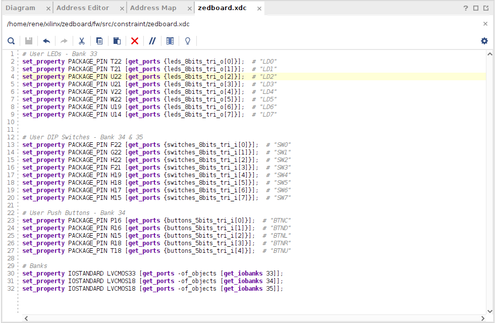

In the **Flow Navigator** panel, run synthesis, implementation and bitstream generation. Select **Generate Bitstream** under **PROGRAM AND DEBUG**. This will automaticall run the other steps if needed.


Select **Yes**.


Select **OK** to start the run. The **Log** tab at the bottom will show progress and any warnings or errors. The **Design Runs** tab will show all the steps performed.


Once the bitstream is generated. A dialog will pop up.


Select **Cancel** to finish.

Now export the hardware platform. In the top level menu select **File->Export->Export Hardware...**


Select **Next**.


Select **Include bitstream**. Select **Next**.


Set the **XSA file name** to **zedboard**, set **Export to** as **~/xilinx/zedboard/fw**. Select **Next**.


Select **Finish**.

There will now be a file `zedboard.xsa` in the directory `~/xilinx/zedboard/fw`.


## Prepare PetaLinux build

Go to the [AMD / Xilinx site](https://www.xilinx.com/support/download.html), and log in (or create a new account).
Select 2024.2, and download

[sstate_arm_2024.2_11061705.tar.gz](https://www.xilinx.com/member/forms/download/xef.html?filename=sstate_arm_2024.2_11061705.tar.gz)
[downloads_2024.2_11061705.tar.gz](https://www.xilinx.com/member/forms/download/xef.html?filename=downloads_2024.2_11061705.tar.gz)

Move and unpack the sstate cache:

```bash
user@machine:~$ mv ~/Downloads/sstate_arm_2024.2_11061705.tar.gz /opt/xilinx/download
user@machine:~$ rm -rf /opt/xilinx/sstate-cache
user@machine:~$ mkdir -p /opt/xilinx/sstate-cache
user@machine:~$ tar xzf /opt/xilinx/download/sstate_arm_2024.2_11061705.tar.gz -C /opt/xilinx/sstate-cache/
```

Unpack the download mirror:

```bash
user@machine:~$ mv ~/Downloads/downloads_2024.2_11061705.tar.gz /opt/xilinx/download
user@machine:~$ rm -rf /opt/xilinx/downloads
user@machine:~$ mkdir -p /opt/xilinx/downloads
user@machine:~$ tar xzf /opt/xilinx/download/downloads_2024.2_11061705.tar.gz -C /opt/xilinx/
```

Set the default command shell to bash
```bash
user@machine:~$ sudo dpkg-reconfigure dash
```

Select **No** and press **Enter**.

## Create a PetaLinux project for zedboard

The script alias `xilinx` already sources PetaLinux, so there is no need to do this again. Move to the **os** directory, and create a project for zedboard.

```bash
user@machine:~$ cd ~/xilinx/zedboard/os
user@machine:~/xilinx/zedboard/os$ petalinux-create project --template zynq --name petalinux --force
```

```
[INFO] Create project: petalinux
[INFO] New project successfully created in /home/user/xilinx/zedboard/os/petalinux
```

Now add the hardware platform to the project:

```bash
user@machine:~/xilinx/zedboard/os$ cd petalinux
user@machine:~/xilinx/zedboard/os/petalinux$ petalinux-config --get-hw-description ../../fw/system_wrapper.xsa
```

```
[INFO] Getting hardware description
[INFO] Renaming zedboard.xsa to system.xsa
[INFO] Extracting yocto SDK to components/yocto. This may take time!
[INFO] Bitbake is not available, some functionality may be reduced.
[INFO] Using HW file: /home/user/xilinx/zedboard/os/petalinux/project-spec/hw-description/system.xsa
[INFO] Getting Platform info from HW file
[INFO] Generating Kconfig for project
```

The configuration menu will be shown. Change the following settings:

- DTG Settings  --->
  - MACHINE_NAME
    - zedboard
- Yocto Setting  --->
- - Add pre-mirror url  --->
    - file:///opt/xilinx/downloads
  - Local sstate feeds settings  --->
    - file:///opt/xilinx/sstate-cache/arm

For now do not select FPGA manager, as that will hang the system when writing to FPGA registers, until the FPGA contents are loaded. If you do not enable the FPGA Manager, the FW will be loaded at startup anyhow.
We'll cover the FPGA manager at a later stage.

```
[INFO] Menuconfig project
[INFO] Generating kconfig for rootfs
[INFO] Silentconfig rootfs
[INFO] Generating configuration files
[INFO] Adding user layers
[INFO] Generating machine conf file
[INFO] Generating plnxtool conf file
[INFO] Generating workspace directory
NOTE: Starting bitbake server...
NOTE: Started PRServer with DBfile: /home/user/xilinx/zedboard/os/petalinux/build/cache/prserv.sqlite3, Address: 127.0.0.1:42153, PID: 33872
INFO: Specified workspace already set up, leaving as-is
INFO: Enabling workspace layer in bblayers.conf
[INFO] Successfully configured project
```

## Build the petalinux project

Build the project:

```bash
user@machine:~/xilinx/zedboard/os/petalinux$ petalinux-build
```

```text
[INFO] Building project
[INFO] Bitbake is not available, some functionality may be reduced.
[INFO] Using HW file: /home/user/xilinx/zedboard/os/petalinux/project-spec/hw-description/system.xsa
[INFO] Getting Platform info from HW file
[INFO] Silentconfig project
[INFO] Silentconfig rootfs
[INFO] Generating configuration files
[INFO] Generating workspace directory
NOTE: Starting bitbake server...
NOTE: Started PRServer with DBfile: /home/user/xilinx/zedboard/os/petalinux/build/cache/prserv.sqlite3, Address: 127.0.0.1:40437, PID: 34083
INFO: Specified workspace already set up, leaving as-is
[INFO] bitbake petalinux-image-minimal
NOTE: Started PRServer with DBfile: /home/user/xilinx/zedboard/os/petalinux/build/cache/prserv.sqlite3, Address: 127.0.0.1:43233, PID: 34144
WARNING: XSCT has been deprecated. It will still be available for several releases. In the future, it's recommended to start new projects with SDT workflow.
Loading cache: 100% |                                                                                                                                                                                                                                                                                                                                                  | ETA:  --:--:--
Loaded 0 entries from dependency cache.
Parsing recipes: 100% |#################################################################################################################################################################################################################################################################################################################################################| Time: 0:01:17
Parsing of 5800 .bb files complete (0 cached, 5800 parsed). 8454 targets, 1106 skipped, 27 masked, 0 errors.
NOTE: Resolving any missing task queue dependencies
NOTE: Fetching uninative binary shim file:///home/user/xilinx/zedboard/os/petalinux/components/yocto/downloads/uninative/6bf00154c5a7bc48adbf63fd17684bb87eb07f4814fbb482a3fbd817c1ccf4c5/x86_64-nativesdk-libc-4.6.tar.xz;sha256sum=6bf00154c5a7bc48adbf63fd17684bb87eb07f4814fbb482a3fbd817c1ccf4c5 (will check PREMIRRORS first)
Checking sstate mirror object availability: 100% |######################################################################################################################################################################################################################################################################################################################| Time: 0:00:49
Sstate summary: Wanted 2713 Local 0 Mirrors 2516 Missed 197 Current 0 (92% match, 0% complete)
NOTE: Executing Tasks
NOTE: Tasks Summary: Attempted 5988 tasks of which 5251 didn't need to be rerun and all succeeded.

Summary: There was 1 WARNING message.
[INFO] Successfully copied built images to tftp dir: /tftpboot
[INFO] Successfully built project
```

Build the SDK:

```bash
user@machine:~/xilinx/zedboard/os/petalinux$ petalinux-build --sdk
```

```text
[INFO] Building project
[INFO] Bitbake is not available, some functionality may be reduced.
[INFO] Using HW file: /home/user/xilinx/zedboard/os/petalinux/project-spec/hw-description/system.xsa
[INFO] Getting Platform info from HW file
[INFO] Silentconfig project
[INFO] Silentconfig rootfs
[INFO] Generating configuration files
[INFO] Generating workspace directory
NOTE: Starting bitbake server...
NOTE: Started PRServer with DBfile: /home/user/xilinx/zedboard/os/petalinux/build/cache/prserv.sqlite3, Address: 127.0.0.1:44475, PID: 204634
INFO: Specified workspace already set up, leaving as-is
[INFO] bitbake petalinux-image-minimal -c do_populate_sdk
NOTE: Started PRServer with DBfile: /home/user/xilinx/zedboard/os/petalinux/build/cache/prserv.sqlite3, Address: 127.0.0.1:37013, PID: 204695
WARNING: XSCT has been deprecated. It will still be available for several releases. In the future, it's recommended to start new projects with SDT workflow.
Loading cache: 100% |###################################################################################################################################################################################################################################################################################################################################################| Time: 0:00:03
Loaded 8452 entries from dependency cache.
Parsing recipes: 100% |#################################################################################################################################################################################################################################################################################################################################################| Time: 0:00:00
Parsing of 5800 .bb files complete (5798 cached, 2 parsed). 8454 targets, 1106 skipped, 27 masked, 0 errors.
NOTE: Resolving any missing task queue dependencies
Checking sstate mirror object availability: 100% |######################################################################################################################################################################################################################################################################################################################| Time: 0:00:46
Sstate summary: Wanted 1415 Local 30 Mirrors 534 Missed 851 Current 1504 (39% match, 70% complete)
NOTE: Executing Tasks
NOTE: Tasks Summary: Attempted 6548 tasks of which 4817 didn't need to be rerun and all succeeded.

Summary: There was 1 WARNING message.
[INFO] Copying SDK Installer...
[INFO] Successfully copied built images to tftp dir: /tftpboot
[INFO] Successfully built project
```

## Packaging

Create a prebuilt package

```bash
user@machine:~/xilinx/zedboard/os/petalinux$ petalinux-package --prebuilt --force
```

```text
[NOTE] Argument: "--prebuilt" has been deprecated. It is recommended to start using new python command line Argument.
[NOTE] Use: petalinux-package prebuilt [OPTIONS]
[INFO] Updating software prebuilt
[INFO] Installing software images
[INFO] Pre-built directory is updated.
```

## Booting

### QEMU

Boot Linux in QEMU

```bash
user@machine:~/xilinx/zedboard/os/petalinux$ petalinux-boot --qemu --prebuilt 3
```

Log in with user `petalinux` and set a password. You are now logged in as petalinux. For root access, `sudo` is needed.

### JTAG boot

Boot Linux on board. Make sure to have a terminal connected to the console, and have jumper set to JTAG boot.
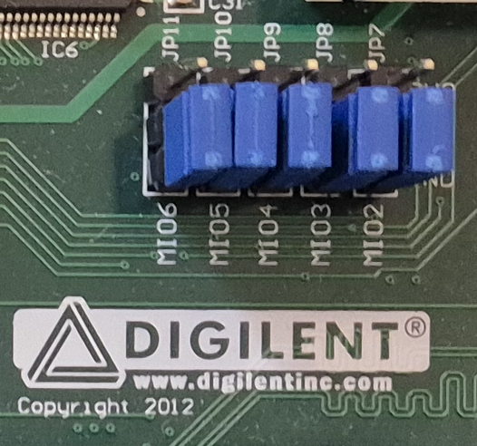

:bangbang: It will take a long time for the board to boot, especially after U-boot has started. It takes 10-20 minutes to load the root filesystem through JTAG.

```bash
user@machine:~/xilinx/zedboard/os/petalinux$ petalinux-boot --jtag --prebuilt 3
```

Output

```text
[NOTE] Argument: "--jtag" has been deprecated. It is recommended to start using new python command line Argument.
[NOTE] Use: petalinux-boot jtag [OPTIONS]
[INFO] FPGA manager enabled, skipping bitstream to load in jtag...
[INFO] Launching XSDB for file download and boot.
[INFO] This may take a few minutes, depending on the size of your image.
attempting to launch hw_server

****** Xilinx hw_server v2024.2
  **** Build date : Oct 31 2024 at 16:10:35
    ** Copyright 1986-2022 Xilinx, Inc. All Rights Reserved.
    ** Copyright 2022-2024 Advanced Micro Devices, Inc. All Rights Reserved.

INFO: hw_server application started
INFO: Use Ctrl-C to exit hw_server application

INFO: To connect to this hw_server instance use url: TCP:127.0.0.1:3121

INFO: Downloading ELF file: /home/user/xilinx/zedboard/os/petalinux/pre-built/linux/images/zynq_fsbl.elf to the target.
INFO: Loading image: /home/user/xilinx/zedboard/os/petalinux/pre-built/linux/images/system.dtb at 0x100000.
INFO: Downloading ELF file: /home/user/xilinx/zedboard/os/petalinux/pre-built/linux/images/u-boot.elf to the target.
INFO: Loading image: /home/user/xilinx/zedboard/os/petalinux/pre-built/linux/images/uImage at 0x200000.
INFO: Loading image: /home/user/xilinx/zedboard/os/petalinux/pre-built/linux/images/rootfs.cpio.gz.u-boot at 0x4000000.
```

USB console:

```text
U-Boot 2024.01 (Oct 24 2024 - 10:42:51 +0000)

CPU:   Zynq 7z020
Silicon: v3.1
Model: Zynq Zed Development Board
DRAM:  ECC disabled 512 MiB
Core:  21 devices, 16 uclasses, devicetree: board
Flash: 0 Bytes
NAND:  0 MiB
MMC:   mmc@e0100000: 0
Loading Environment from nowhere... OK
In:    serial@e0001000
Out:   serial@e0001000
Err:   serial@e0001000
Net:
ZYNQ GEM: e000b000, mdio bus e000b000, phyaddr 0, interface rgmii-id
eth0: ethernet@e000b000
Hit any key to stop autoboot:  0
JTAG: Trying to boot script at 3000000
## Executing script at 03000000
Trying to load boot images from jtag
## Booting kernel from Legacy Image at 00200000 ...
   Image Name:   Linux-6.6.40-xilinx-g2b7f6f70a62
   Image Type:   ARM Linux Kernel Image (uncompressed)
   Data Size:    4899720 Bytes = 4.7 MiB
   Load Address: 00200000
   Entry Point:  00200000
   Verifying Checksum ... OK
## Loading init Ramdisk from Legacy Image at 04000000 ...
   Image Name:   petalinux-image-minimal-zynq-gen
   Image Type:   ARM Linux RAMDisk Image (uncompressed)
   Data Size:    25820709 Bytes = 24.6 MiB
   Load Address: 00000000
   Entry Point:  00000000
   Verifying Checksum ... OK
# Flattened Device Tree blob at 00100000
   Booting using the fdt blob at 0x100000
Working FDT set to 100000
   Loading Kernel Image
   Loading Ramdisk to 1c22c000, end 1dacbe25 ... OK
   Loading Device Tree to 1c224000, end 1c22bd3b ... OK
Working FDT set to 1c224000

Starting kernel ...

Booting Linux on physical CPU 0x0

...

********************************************************************************************
The PetaLinux source code and images provided/generated are for demonstration purposes only.
Please refer to https://xilinx-wiki.atlassian.net/wiki/spaces/A/pages/2741928025/Moving+from+PetaLinux+to+Production+Deployment
for more details.
********************************************************************************************
PetaLinux 2024.2+release-S11061705 petalinux ttyPS0

petalinux login:
```

Log in with user `petalinux` and set a password. You are now logged in as petalinux. For root access, `sudo` is needed.

### TFTP boot

To boot from TFTP, make sure to have a terminal connected to the console, and have jumper set to JTAG boot.

The boot the board to U-boot.

As soon as the U-boot countdown starts, interrupt the countdown with a key in the USB console.

```bash
user@machine:~/xilinx/zedboard/os/petalinux$ petalinux-boot --jtag --prebuilt 2
```

USB console:

```text
U-Boot 2024.01 (Oct 24 2024 - 10:42:51 +0000)

CPU:   Zynq 7z020
Silicon: v3.1
Model: Zynq Zed Development Board
DRAM:  ECC disabled 512 MiB
Core:  21 devices, 16 uclasses, devicetree: board
Flash: 0 Bytes
NAND:  0 MiB
MMC:   mmc@e0100000: 0
Loading Environment from nowhere... OK
In:    serial@e0001000
Out:   serial@e0001000
Err:   serial@e0001000
Net:
ZYNQ GEM: e000b000, mdio bus e000b000, phyaddr 0, interface rgmii-id
eth0: ethernet@e000b000
Hit any key to stop autoboot:  0
Zynq>
```

In the USB console type:

```
dhcp
setenv serverip 192.168.1.123 (address of the TFTP server)
setenv ipaddr 192.168.1.111 (address of board given by DHCP)
pxe get
```

USB console:

```text
Zynq> dhcp
BOOTP broadcast 1
DHCP client bound to address 192.168.1.188 (4 ms)
*** Warning: no boot file name; using 'C0A801BC.img'
Using ethernet@e000b000 device
TFTP from server 192.168.1.1; our IP address is 192.168.1.188
Filename 'C0A801BC.img'.
Load address: 0x0
Loading: *
TFTP server died; starting again
Zynq> setenv serverip 192.168.1.91
Zynq> setenv ipaddr 192.168.1.188
Zynq> pxe get
missing environment variable: pxeuuid
Retrieving file: pxelinux.cfg/01-00-0a-35-00-1e-53
Using ethernet@e000b000 device
TFTP from server 192.168.1.91; our IP address is 192.168.1.188
Filename 'pxelinux.cfg/01-00-0a-35-00-1e-53'.
Load address: 0x2000000
Loading: *
TFTP error: 'File not found' (1)
Not retrying...

...

Retrieving file: pxelinux.cfg/default-arm
Using ethernet@e000b000 device
TFTP from server 192.168.1.91; our IP address is 192.168.1.188
Filename 'pxelinux.cfg/default-arm'.
Load address: 0x2000000
Loading: *
TFTP error: 'File not found' (1)
Not retrying...
Retrieving file: pxelinux.cfg/default
Using ethernet@e000b000 device
TFTP from server 192.168.1.91; our IP address is 192.168.1.188
Filename 'pxelinux.cfg/default'.
Load address: 0x2000000
Loading: #
         68.4 KiB/s
done
Bytes transferred = 70 (46 hex)
Config file '<NULL>' found
Zynq> pxe boot
1:      Linux
Retrieving file: zImage
Using ethernet@e000b000 device
TFTP from server 192.168.1.91; our IP address is 192.168.1.188
Filename 'zImage'.
Load address: 0x2000000

...

********************************************************************************************
The PetaLinux source code and images provided/generated are for demonstration purposes only.
Please refer to https://xilinx-wiki.atlassian.net/wiki/spaces/A/pages/2741928025/Moving+from+PetaLinux+to+Production+Deployment
for more details.
********************************************************************************************
PetaLinux 2024.2+release-S11061705 petalinux ttyPS0

petalinux login:
```

Then log in and ping a server:

```bash
petalinux login: petalinux
You are required to change your password immediately (administrator enforced).
New password:
Retype new password:
petalinux:~$ ping google.com
PING google.com (216.58.214.14): 56 data bytes
64 bytes from 216.58.214.14: seq=0 ttl=118 time=4.826 ms
64 bytes from 216.58.214.14: seq=1 ttl=118 time=4.635 ms
64 bytes from 216.58.214.14: seq=2 ttl=118 time=4.587 ms
64 bytes from 216.58.214.14: seq=3 ttl=118 time=4.638 ms
^C
--- google.com ping statistics ---
4 packets transmitted, 4 packets received, 0% packet loss
round-trip min/avg/max = 4.587/4.671/4.826 ms
```

Try out the date:

```bash
petalinux:~$ date
Fri Mar  9 12:39:43 UTC 2018
```

You can see that the NTP server is not yet configured.

### SD boot

#### Create partitions

Insert an SD card and find out which device it is in (normally /dev/sdb).
If there is already a partition on the SD card, you can e.g. use mount:

```bash
user@machine:~$ mount
```

```text
...

/dev/sdb1 on /media/rene/boot type vfat (rw,nosuid,nodev,relatime,uid=1000,gid=1000,fmask=0022,dmask=0022,codepage=437,iocharset=iso8859-1,shortname=mixed,showexec,utf8,flush,errors=remount-ro,uhelper=udisks2)
```

Run fdisk to partition the device.
First make sure to remove all partitions.
The create two partitions, the first one not larger than 2GiB, the second for the rest of the SD card.
In the case below there is one partition on the card, and the card is in total ~8 GiB.

```bash
user@machine:~$ sudo fdisk /dev/sdb
```

```
Welcome to fdisk (util-linux 2.37.2).
Changes will remain in memory only, until you decide to write them.
Be careful before using the write command.

This disk is currently in use - repartitioning is probably a bad idea.
It's recommended to umount all file systems, and swapoff all swap
partitions on this disk.


Command (m for help): d (DO THIS FOR ALL PARTITIONS)

Selected partition 1
Partition 1 has been deleted.

Command (m for help): n
Partition type
   p   primary (0 primary, 0 extended, 4 free)
   e   extended (container for logical partitions)
Select (default p): p
Partition number (1-4, default 1): 
First sector (2048-15802367, default 2048): 
Last sector, +/-sectors or +/-size{K,M,G,T,P} (2048-15802367, default 15802367): 3800000

Created a new partition 1 of type 'Linux' and of size 1,8 GiB.
Partition #1 contains a vfat signature.

Do you want to remove the signature? [Y]es/[N]o: y

The signature will be removed by a write command.

Command (m for help): n
Partition type
   p   primary (1 primary, 0 extended, 3 free)
   e   extended (container for logical partitions)
Select (default p): p
Partition number (2-4, default 2): 
First sector (3800001-15802367, default 3801088): 
Last sector, +/-sectors or +/-size{K,M,G,T,P} (3801088-15802367, default 15802367): 

Created a new partition 2 of type 'Linux' and of size 5,7 GiB.

Command (m for help): w
The partition table has been altered.
Syncing disks.
```

You may get a warning that the SD card is already mounted as above. Make sure to unmount the device in that case.
E.g.:

```bash
user@machine:~$ sudo umount /dev/sdb1
```

#### Create file systems

Create file systems on the SD card.

```bash
user@machine:~$ sudo mkfs.vfat /dev/sdb1
mkfs.fat 4.2 (2021-01-31)
user@machine:~$ sudo mkfs.ext4 /dev/sdb2
mke2fs 1.46.5 (30-Dec-2021)
Creating filesystem with 1500160 4k blocks and 375360 inodes
Filesystem UUID: caf0f358-b46f-4524-801b-f7a0e763c6ad
Superblock backups stored on blocks: 
	32768, 98304, 163840, 229376, 294912, 819200, 884736

Allocating group tables: done                            
Writing inode tables: done                            
Creating journal (16384 blocks): done
Writing superblocks and filesystem accounting information: done
```

#### Create partitions

Look for partitions:

```bash
ls /media/$(id -un)
```

You should at least see two partitions, one with a short name (xxxx-xxxx) and one with a GUID name (xxxxxxxx-xxx-xxx-xxx-xxxxxxxxxxxx).
The boot partition is the short name, the GUID is the Linux partition

```text
2A3D-259F   caf0f358-b46f-4524-801b-f7a0e763c6ad
```

Copy files to the boot partition:

```bash
sudo rm -rf /media/$(id -un)/2A3D-259F/*
sudo cp ~/xilinx/zedboard/os/petalinux/build/tmp/deploy/images/zynq-generic-7z020/boot.bin /media/$(id -un)/2A3D-259F/
sudo cp /tftpboot/boot.scr /media/$(id -un)/2A3D-259F/
sudo cp /tftpboot/image.ub /media/$(id -un)/2A3D-259F/
sudo cp /tftpboot/system.dtb /media/$(id -un)/2A3D-259F/
```

Extract root file system to the Linux partition:

```bash
sudo rm -rf /media/$(id -un)/caf0f358-b46f-4524-801b-f7a0e763c6ad/*
sudo tar xzf /tftpboot/rootfs.tar.gz -C /media/$(id -un)/caf0f358-b46f-4524-801b-f7a0e763c6ad/
```

#### Boot from SD

Synchronize the SD contents.

```bash
user@machine:~$ sync
```

Eject the SD card in Ubuntu:

Right click on one of the SD partitions, and select **Unmount**.

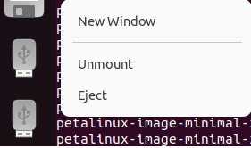

You can now take out the SD card and place it in the board.

Make sure the jumpers are set correctly for SD card boot.


Power on the board and make sure to attach the console.

```text
U-Boot 2024.01 (Oct 24 2024 - 10:42:51 +0000)

CPU:   Zynq 7z020
Silicon: v3.1
Model: Zynq Zed Development Board
DRAM:  ECC disabled 512 MiB
Core:  21 devices, 15 uclasses, devicetree: board
Flash: 0 Bytes
NAND:  0 MiB
MMC:   mmc@e0100000: 0
Loading Environment from FAT... *** Error - No Valid Environment Area found
*** Warning - bad env area, using default environment

In:    serial@e0001000
Out:   serial@e0001000
Err:   serial@e0001000
Net:
ZYNQ GEM: e000b000, mdio bus e000b000, phyaddr 0, interface rgmii-id
eth0: ethernet@e000b000
Hit any key to stop autoboot:  0
switch to partitions #0, OK
mmc0 is current device
Scanning mmc 0:1...
Found U-Boot script /boot.scr
3830 bytes read in 14 ms (266.6 KiB/s)
## Executing script at 03000000
Trying to load boot images from mmc0
30773307 bytes read in 1682 ms (17.4 MiB/s)
## Loading kernel from FIT Image at 10000000 ...
   Using 'conf-system-top.dtb' configuration
   Verifying Hash Integrity ... OK
   Trying 'kernel-1' kernel subimage
     Description:  Linux kernel
     Type:         Kernel Image
     Compression:  uncompressed
     Data Start:   0x100000ec
     Data Size:    4899720 Bytes = 4.7 MiB
     Architecture: ARM
     OS:           Linux
     Load Address: 0x00200000
     Entry Point:  0x00200000
     Hash algo:    sha256
     Hash value:   2f020eb6eb9ee5258fec0e443e4d6cacbdbbb7d91d6340bfd88648aaeaabf                                                                                                                                                                                                                                                                   6b6
   Verifying Hash Integrity ... sha256+ OK
## Loading ramdisk from FIT Image at 10000000 ...
   Using 'conf-system-top.dtb' configuration
   Verifying Hash Integrity ... OK
   Trying 'ramdisk-1' ramdisk subimage
     Description:  petalinux-image-minimal
     Type:         RAMDisk Image
     Compression:  uncompressed
     Data Start:   0x104b1830
     Data Size:    25850464 Bytes = 24.7 MiB
     Architecture: ARM
     OS:           Linux
     Load Address: unavailable
     Entry Point:  unavailable
     Hash algo:    sha256
     Hash value:   8165868ae82bb9bcee7387a704bed3a049158b091e7cf1e3d92597d96c2fb                                                                                                                                                                                                                                                                   a02
   Verifying Hash Integrity ... sha256+ OK
## Loading fdt from FIT Image at 10000000 ...
   Using 'conf-system-top.dtb' configuration
   Verifying Hash Integrity ... OK
   Trying 'fdt-system-top.dtb' fdt subimage
     Description:  Flattened Device Tree blob
     Type:         Flat Device Tree
     Compression:  uncompressed
     Data Start:   0x104ac580
     Data Size:    20963 Bytes = 20.5 KiB
     Architecture: ARM
     Hash algo:    sha256
     Hash value:   b63f1cac6f13a8beb5adcc90c8cb40415a6edc89c306363a29c725f6170b5                                                                                                                                                                                                                                                                   fc6
   Verifying Hash Integrity ... sha256+ OK
   Booting using the fdt blob at 0x104ac580
Working FDT set to 104ac580
   Loading Kernel Image
   Loading Ramdisk to 1c21a000, end 1dac1260 ... OK
   Loading Device Tree to 1c211000, end 1c2191e2 ... OK
Working FDT set to 1c211000

Starting kernel ...

Booting Linux on physical CPU 0x0
Linux version 6.6.40-xilinx-g2b7f6f70a62a (oe-user@oe-host) 

...

Starting rpcbind daemon...done.
starting statd: done
Starting internet superserver: inetd.
NFS daemon support not enabled in kernel
Starting syslogd/klogd: done
Starting tcf-agent: OK

********************************************************************************************
The PetaLinux source code and images provided/generated are for demonstration purposes only.
Please refer to https://xilinx-wiki.atlassian.net/wiki/spaces/A/pages/2741928025/Moving+from+PetaLinux+to+Production+Deployment
for more details.
********************************************************************************************
PetaLinux 2024.2+release-S11061705 petalinux ttyPS0

petalinux login: petalinux
You are required to change your password immediately (administrator enforced).
New password:
Retype new password:
petalinux:~$ sudo devmem 0x41200000 32 0xff (YOU SHOULD SEE ALL LEDS TURN ON)
We trust you have received the usual lecture from the local System
Administrator. It usually boils down to these three things:

    #1) Respect the privacy of others.
    #2) Think before you type.
    #3) With great power comes great responsibility.

For security reasons, the password you type will not be visible.

Password:
petalinux:~$ sudo devmem 0x41200000 32 0x01 (YOU SHOULD SEE ONLY THE RIGHT LED TURN ON)
petalinux:~$ sudo devmem 0x41200008 (YOU SHOULD SEE THE STATUS OF THE SWITCHES)
0x00000009
petalinux:~$ sudo devmem 0x41200008 (YOU SHOULD SEE THE STATUS OF THE SWITCHES)
0x00000001
petalinux:~$ sudo devmem 0x41210000 (YOU SHOULD SEE THE STATUS OF THE BUTTONS)
0x00000001
petalinux:~$ sudo devmem 0x41210000 (YOU SHOULD SEE THE STATUS OF THE BUTTONS)
0x00000000
petalinux:~$ sudo devmem 0x41210000 (YOU SHOULD SEE THE STATUS OF THE BUTTONS)
0x00000004
petalinux:~$ sudo devmem 0x41210000 (YOU SHOULD SEE THE STATUS OF THE BUTTONS)
0x00000008
petalinux:~$ sudo devmem 0x41210000 (YOU SHOULD SEE THE STATUS OF THE BUTTONS)
0x00000010
petalinux:~$ sudo devmem 0x41210000 (YOU SHOULD SEE THE STATUS OF THE BUTTONS)
0x00000002
petalinux:~$ sudo poweroff
Password:

Broadcast message from root@petalinux (pg down for system halt NOW!

INIT: Sending processes configured via /etc/inittab the TERM signal
petalinux:~$ Stopping OpenBSD Secure Shell server: sshdstopped /usr/sbin/sshd (pid 624)
.
hwclock: can't open '/dev/misc/rtc': No such file or directory
Stopping internet superserver: inetd.
stopping mountd: done
stopping nfsd: done
Stopping syslogd/klogd: stopped syslogd (pid 644)
stopped klogd (pid 647)
done
Stopping tcf-agent: OK
stopping statd: done
Unmounting remote filesystems...
Stopping rpcbind daemon...
done.
Deconfiguring network interfaces... macb e000b000.ethernet enx000a35001e53: Link is Down
macb e000b000.ethernet enx000a35001e53: PHY [e000b000.ethernet-ffffffff:00] driver [Marvell 88E1510] (irq=POLL)
macb e000b000.ethernet enx000a35001e53: configuring for phy/rgmii-id link mode
done.
Sending all processes the TERM signal...
macb e000b000.ethernet enx000a35001e53: Link is Up - 1Gbps/Full - flow control tx
Sending all processes the KILL signal...
Deactivating swap...
Unmounting local filesystems...
EXT4-fs (mmcblk0p2): unmounting filesystem caf0f358-b46f-4524-801b-f7a0e763c6ad.
reboot: System halted
```

## Writing SW

To be covered.